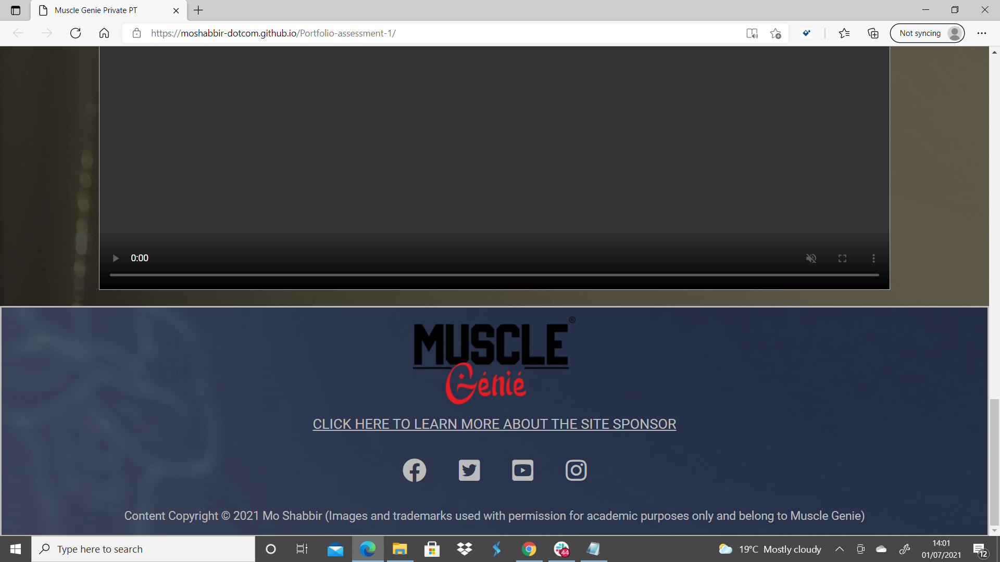

# PORTFOLIO-ASSESSMENT-1
* A simple website for a bespoke personal training service providing 1 to 1 or 1 to 2 sessions in a fully private air conditioned and COVID safe environment.
## User Objectives-
* Intuative ease of navigation between pages.
* Understanding of what service the business offers and consumer benefits of the service. (benefits)
* Visual examples of some equipment availiable. (set expectation of quality)
* Awareness of location. (map)
* Knowledge of why this service is suitable for them. (Simplify the science)
## Site Owner Objectives-
* To ensure visitor to the site recieves all information without being overloaded. (Use multiple forms such as video, written and pictorial)
* Have a way to obtain customer data and prompt a discussion with potential clients. (contact methods)
* Personalised service does not allow for online bookings as client base should remain exclusive to remain premium however there is opportunity to adapt the business model to allow for this. (Will involve backend coding work- See opportunities)
# DESIGN-
* Typography used is Noto Sans JP for headings and Roboto for the text in the main body with a fallback of Sans-serif in both cases.
* Colour scheme has been chosen to be contrasting with light/dark colour breaks not too drastic as the font colours are uniform throughout the site including the hero colour. Imagery has been used to add to this contrast by inverting the colours on the header and footer whilst allowing for the focus to alternate. (i.e. Header is inverted colours with body of the genie on the left, Main section background has been dampened with a burlesque filter on the image, and the footer is inverted colours with smoke of the genie on the left.) This was chosen to be striking and unique whilst allowing trade,marks to be visible without taking away from content.

## Wireframe mocks-

## Wireframe realisation after deployment-
### Mobile & portrait tablet

### Landscape tablet & desktop

# FEATURES-
* Website is responsive on multiple device sizes.
* Interactive elements such as video, form and map.

# LANGUAGES-
* [HTML5] (https://en.wikipedia.org/wiki/HTML5)
* [CSS3] (https://en.wikipedia.org/wiki/Cascading_Style_Sheets)

# LIBRARIES & PROGRAMS-
* [Google Fonts:](https://fonts.google.com/) Google fonts were used to import the "Noto San JP" & "Roboto" fonts into the pa1style.css file which is used on all pages of the website.
* [Font Awesome:](https://fontawesome.com/) Font Awesome was used on "index" and "contact" pages throughout the website to add icons for aesthetic purposes and add to the UX of the site.
* [GitHub:](https://github.com/) GitHub was used to store the projects code after being pushed from Gitpod.
* [Gitpod:](https://gitpod.io/) Gitpod was used to write the project code.
* [TinyPNG](https://tinypng.com) TinyPNG was used to compress image sizes to aid in page loading speed. However does not support files sizes above 5mb without paid subscription.

# DETAILED SECTION SUMMARY-
## Navigation Menu- 
* On all pages of the website allowing for ease of identification and navigation of site to the homepage, gallery and signup pages. This will allow for ease of moving between sections of the website without the need to utilise the back buttons of the browser being used. Line break has been used to create space from the header section.
## Landing Page- 
* The image used on the landing page is an inversion of the "genie" logo trademarked to muscle genie and is used across all pages to allow for consistancy and brand awareness. The HEADER and FOOTER have the same image fixed in the background to give the pages the illusion of "rolling" over the background picture. Reason for inversion of "genie" picture is to allow for aesthetically pleasing colour break whilst still allowing for font colours that are visible on both backrounds as well as fallback backgrounds.
## Header- 
Has a trademarked text logo above the website title to be the first thing the visitor sees and with the colour breaks of the site being a contrast of light and dark a "hero" colour of red has been used to draw attention to the branding.
## Main Section- 
* Introduces reasons and benefits to undertake a physical exercise programme and also adresses potential barriers in order to engage the visitor viewing the site. As a result the visitor should be aware of the benefits of exercise and what benefits they could achieve by undertaking a program supervised by a qualified professional.

* Introduction video of short duration has been embedded into the home page in order to convey more information without causing the viewer to be bombarded with excessive text. Video file has been set to not autoplay and muted with controls for a better UX.
## Footer- 
* As per the HEADER section it as a trademarked text logo above the website title to be the first thing the visitor sees and with the colour breaks of the site being a contrast of light and dark a "hero" colour of red has been used to draw attention to the branding and any clickable links when hovering such as the social media links and the link to the external "www.musclegenie.com" site which is planned to be going live before the end of 2021.
## Gallery- 
* Static pictures of equipment available in the private studio as well as images of commercial equipment available to potential clients to aid in engagment and further build on interest of the bespoke service. 
* Images have been reduced in size to improve page load speed although there are still some that were larger than would be optimal for a website due to tinypng not supporting files over 5mb without a paid subscription.
## Contact Page- 
* Basic level contact information for a callback or follow up email with requests for key information that a specialist personal trainer would need to be aware of before discussing suitable programmes.

# TESTING-
* Tested through W3C code tester for HTML and W3C for CSS with no errors. The were warnings on all 3 html pages advising the use of h2 to h6 tags due to the word "section" being used in the html code although this was not required for this project and in future would be avoided.

* The website was tested on MS edge, IE10, Google chrome and safari browsers.
* The website was tested on Iphone 11, Ipad 2 and Samsung galaxy s10+.
* People in the acknowledgement section and family/friends were asked to navigate the site and give feedback on any difficulties encountered.

## Bugs- 
* Formatting issues with CSS due to default browser margins affecting code written for benefits section on the main page as well as header and footer sections. This was solved by setting a border box and sdjusting each section individually dependant on amount of content whilst keeping overall uniformity of website.

* When compressing video file it was compressed too much to the point the video became pixalated hence resolution was increased to provide a balance between speed of loading and video quality although when on larger screensizes pixalation is slightly visible.

# DEPLOYMENT-
The project was deployed to GitHub Pages using the following procedure:

* Logged in to github and selected the github repository required.
* Selected the settings option.
* Went to the github pages section.
* Under the source tab the dropdown "none" was changed to "master branch".
* The page then refreshed.
* The gihub pages section then had a link to the published page.

# CREDITS- 
* Code for the form was resused from my challenge 2 submission at the end of the running walkthrough. This was then adjusted and added to in order to make it relevant for what the CONTACT page was trying to achieve.
* Credit is also given to my mentor Can Sucullu who provided me with the code to place the map on the contact page and showed me where I was going wrong in the process.
* Thanks also to Bim Williams who introduced me to the benefits of using flex as a CSS element and sent me some extra curricular reading material to understand CSS far better.

# CONTENT & MEDIA-
* All photos and videos are copyright of Muscle Genie and used with permission of owner. The muscle genie logo(s) are trademarked.

# OPPORTUNITIES- 
* As more specialist health & fitness services begin to be offered the contact form can be updated with the options that are looking to be offered in the future such as fire cupping/ Hijama and other complimentary therapies.

* When the complimentary therapies are launched, a online diary booking facility could be implemented with a working form option. (This projects form is non functioning as it is only html & css.)

* Website storage would be reduced by using an iframe URL linked to youtube as opposed to the locally stored video file. The reason for this is that this website will not be the offical website for muscle genie which is still under development and links to ther official address have been added to the project for when the business is officially launched so uploading to youtube would not have been suitable in this instance. 

* Not all images were able to be compressed due to free compression software not supporting file sizes greater than 5mb. Before deployment as a functioning site this would be addressed and file sizes compressed even further.